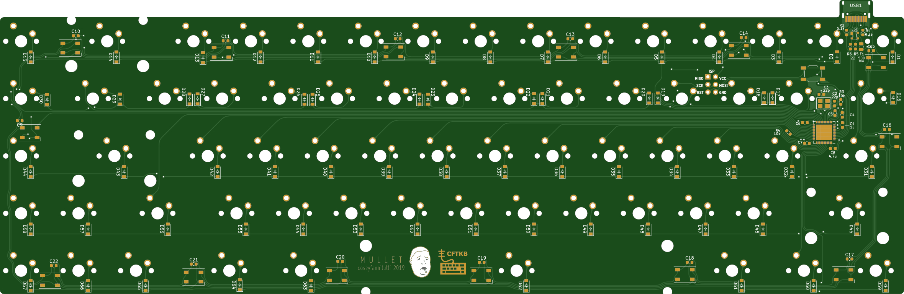

# mullet
To open this PCB in KiCad you will need to use a newer nightly development build because of some of the scripting for teardrops and features saved in the files that are not yet available in the most recent stable build.
This should eventually be able to be opened with a stable KiCad release, but for now it can only be opened and edited with nightly builds.

